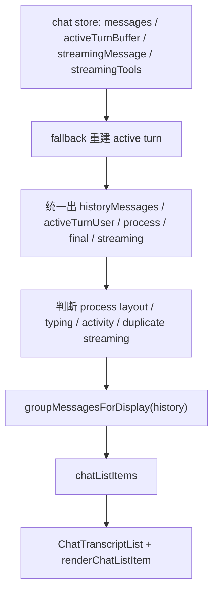

# Chat 消息处理逻辑简化计划

## 背景

Chat 页面目前已经把消息列表的虚拟滚动外壳抽到了 `src/pages/Chat/ChatTranscriptList.tsx`，但 `src/pages/Chat/index.tsx` 仍然承担了大量消息 view model 派生逻辑。页面里同时处理：

- 从 chat store 读取历史消息、active turn、streaming message、tool status
- 在没有 `activeTurnBuffer` 时，从历史消息重建 fallback active turn
- 将 assistant 内容拆成 process 区和 final reply 区
- 判断 typing、activity、streaming final、recent completed turn 等展示状态
- 生成 `chatListItems` 和滚动签名
- 渲染 active turn、collapsed process turn、process section

这些逻辑本身大多有业务必要性，但现在集中在页面组件中，导致阅读时需要同时理解数据修复、展示规则、滚动锚点和具体 UI。

## 当前消息处理链路



### 主要输入

- `messages`：当前会话历史消息
- `activeTurnBuffer`：运行中或刚完成的一轮对话缓存，包含 history、user、assistant、process、final、streaming 拆分结果
- `streamingMessage`：当前流式输出，可能是字符串，也可能是结构化 assistant message
- `streamingTools`：当前工具调用状态
- `sending` / `pendingFinal` / `sendStage`：发送和收尾状态
- `lastUserMessageAt`：fallback active turn 的时间窗口判断依据

### 页面内派生出的核心对象

- `displayHistoryMessages`：历史区实际展示的消息
- `displayHistoryItems`：历史消息分组后的 `message` 或 `turn`
- `activeTurnUserMessage`：当前轮的用户消息
- `activeTurnProcessMessages`：当前轮已落盘的过程消息
- `activeTurnProcessStreamingMessage`：当前轮过程区的流式消息
- `resolvedPersistedFinalMessage`：当前轮已落盘的最终回复
- `activeTurnFinalStreamingMessage`：当前轮最终回复区的流式消息
- `chatListItems`：传给 `ChatTranscriptList` 的最终列表数据
- `latestTranscriptActivitySignature`：供滚动控制器判断内容变化的签名

## 复杂度来源

1. `activeTurnBuffer` 和 fallback active turn 双轨并存，导致同一概念有两套变量
2. “从历史消息恢复 active turn” 和 “决定 UI 怎么显示 active turn” 混在一起
3. process/final 拆分在 `history-grouping.ts` 和页面中都有参与，边界不够清晰
4. 页面既生成 transcript view model，又直接渲染 active/process turn 组件
5. 滚动签名依赖中间变量，使消息派生逻辑和滚动控制逻辑耦合
6. 很多布尔值是组合条件，比如 `shouldUseProcessLayout`、`showProcessActivity`、`shouldShowRecentCompletedTurnLayout`，读者需要向上追溯大量上下文

## 目标

- 让 `Chat/index.tsx` 不再直接展开消息派生细节
- 将“消息数据归一化”和“UI 展示选择”分层
- 保留现有行为、测试和滚动锚点稳定性
- 让后续修改 streaming/process/final 逻辑时有明确入口

非目标：

- 不重写 chat store
- 不改变 Gateway 通信协议
- 不改变消息 UI 视觉表现
- 不引入新的状态管理库

## 建议拆分方案

### 第一步：抽出 transcript view model hook

新增 `src/pages/Chat/useChatTranscriptModel.ts`。

职责：

- 接收页面需要的原始状态和设置项
- 处理 `activeTurnBuffer` 优先、fallback active turn 兜底的归一化
- 生成历史展示项、active turn 展示数据、typing/activity/streaming final 列表项
- 返回滚动控制器需要的签名字段

建议返回结构：

```ts
type ChatTranscriptModel = {
  activeTurn: ActiveTurnViewModel | null;
  chatListItems: ChatListItem[];
  displayHistoryItems: HistoryDisplayItem[];
  latestTranscriptActivitySignature: string;
  scroll: {
    activeTurnScrollKey: string | null;
    shouldHideStandaloneStreamingAvatar: boolean;
  };
};
```

这样页面只保留：

- store 选择器
- `useChatTranscriptModel(...)`
- `useChatScrollController(...)`
- attachment preview / queued draft / layout 状态
- list/input/preview 渲染

### 第二步：把 fallback active turn 变成纯函数

新增或放入 hook 同文件：

```ts
function buildFallbackActiveTurn(input: FallbackActiveTurnInput): NormalizedActiveTurnSource
```

它只负责在没有 `activeTurnBuffer` 时，从 `messages`、`streamingMessage`、`lastUserMessageAt`、`sending` 中恢复：

- history messages
- active user message
- assistant process messages
- persisted final message
- streaming process/final message
- duplicate streaming 标记

这样最难读的一段可以单独写单测，页面不再出现大量 `fallback*` 变量。

### 第三步：建立统一的 ActiveTurnViewModel

定义一个页面层 view model，屏蔽 `activeTurnBuffer` 和 fallback 的差异：

```ts
type ActiveTurnViewModel = {
  userMessage: RawMessage;
  startedAtMs: number;
  processMessages: RawMessage[];
  processStreamingMessage: RawMessage | null;
  finalMessage: RawMessage | null;
  finalStreamingMessage: RawMessage | null;
  showActivity: boolean;
  showTyping: boolean;
  useProcessLayout: boolean;
  streamingTools: ToolStatus[];
  scrollKey: string;
};
```

`ActiveTurn` 组件后续只接收这个 view model 或少量展开 props，避免父页面重复计算它的展示条件。

### 第四步：拆出 process turn 渲染组件

新增 `src/pages/Chat/ChatProcessTurn.tsx`，移动：

- `ProcessSection`
- `CollapsedProcessTurn`
- `ActiveTurn`
- `TypingIndicator`
- `ActivityIndicator`
- process activity copy / duration helpers

页面的 `renderChatListItem` 可以变成很薄的分发层：

```tsx
switch (item.type) {
  case 'history':
    return <HistoryTranscriptItem item={item.item} ... />;
  case 'active-turn':
    return <ActiveTurnView turn={model.activeTurn} ... />;
  case 'streaming-final':
    return <ChatMessage ... />;
  case 'activity':
    return <ActivityIndicator />;
  case 'typing':
    return <TypingIndicator />;
}
```

### 第五步：补单测锁定 view model 行为

新增 `tests/unit/chat-transcript-model.test.ts`，重点覆盖：

- 有 `activeTurnBuffer` 时优先使用 store 结构
- 无 `activeTurnBuffer` 且 `sending=true` 时，从最后一个 user message 重建 active turn
- streaming 内容与已落盘 assistant 重复时不重复展示
- recent completed turn grace window 内仍显示过程态布局
- internal maintenance user message 不展示 active turn
- `pendingFinal` 和 `streamingTools` 生成 activity item
- 无流式内容且 sending 时生成 typing item

## 预计文件变化

- 新增：`src/pages/Chat/useChatTranscriptModel.ts`
- 可能新增：`src/pages/Chat/ChatProcessTurn.tsx`
- 修改：`src/pages/Chat/index.tsx`
- 修改：`src/pages/Chat/ChatTranscriptList.tsx`，仅在 item 类型需要调整时改
- 修改或新增：`tests/unit/chat-transcript-model.test.ts`

## 分阶段执行建议

### Phase 1：只抽 hook，不改渲染组件

收益最大、风险最低。将 `index.tsx` 中消息派生逻辑搬到 `useChatTranscriptModel`，输出仍保持现有 props 形态，确保行为不变。

验收：

- `Chat/index.tsx` 中不再出现大段 `fallback*` 变量
- `chatListItems` 和 `latestTranscriptActivitySignature` 由 hook 返回
- 现有聊天单测通过

### Phase 2：抽 process turn 组件

把 active/process/collapsed turn 的渲染和 helper 移出页面。此阶段主要改善文件长度和阅读边界。

验收：

- `Chat/index.tsx` 只负责页面布局和 item 分发
- process 展示相关 helper 与组件集中在 `ChatProcessTurn.tsx`
- UI 行为和测试保持不变

### Phase 3：收敛类型和命名

如果前两步稳定，再考虑将 `ChatListItem`、`ActiveTurnViewModel`、`NormalizedActiveTurnSource` 等类型放到独立 `transcript-types.ts`。

验收：

- 类型边界清晰
- hook、list、process turn 不形成循环 import

## 风险点

- 滚动锚点依赖 `chatListItems` key 和 `activeTurnScrollKey`，迁移时不能改变 key 生成规则
- streaming duplicate 判断影响是否重复显示最终回复，需要单测覆盖
- `recent completed turn` 的 grace window 会影响刚完成时的 UI 形态，容易回归
- process/final 拆分不能改变 `_attachedFiles` 的处理方式
- `useDeferredValue(historyMessages)` 和 active turn 去重逻辑需要保留，否则可能出现用户消息重复显示

## 建议验证命令

```bash
pnpm exec eslint src/pages/Chat/index.tsx src/pages/Chat/useChatTranscriptModel.ts src/pages/Chat/ChatTranscriptList.tsx
pnpm exec vitest run tests/unit/chat-page-process-turn.test.tsx tests/unit/chat-message.test.tsx tests/unit/chat-message-utils.test.ts
pnpm exec vitest run tests/unit/chat-transcript-model.test.ts
```

如果涉及用户可见 UI 结构变更，再补跑相关 E2E：

```bash
pnpm run build:vite
pnpm exec playwright test tests/e2e/chat-stream-stability.spec.ts tests/e2e/chat-process-step-complete-without-refresh.spec.ts
```
